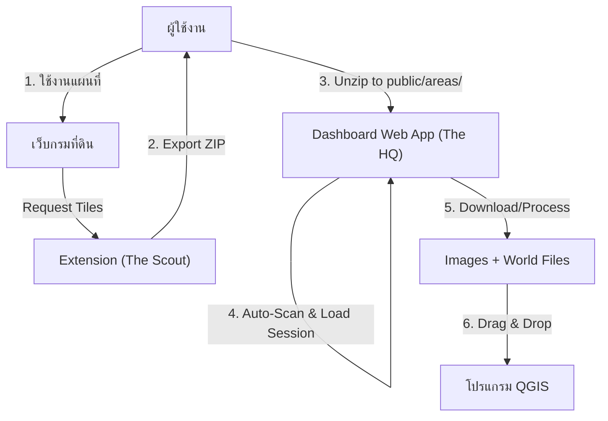

# Landmap Scraper Suite

ชุดเครื่องมือระดับมืออาชีพสำหรับดึงข้อมูลระวางที่ดิน (WMS Tiles) จากกรมที่ดิน เพื่อนำไปใช้งานในระบบ GIS (QGIS, ArcGIS) ได้อย่างแม่นยำและมีประสิทธิภาพ

## 🏛️ System Architecture (สถาปัตยกรรมระบบ)

เราออกแบบระบบโดยยึดหลัก **"Separation of Concerns"** เพื่อความเสถียรและยืดหยุ่น โดยแบ่งการทำงานออกเป็น 2 ส่วนหลัก คือ **The Scout** (ตัวเก็บข้อมูล) และ **The HQ** (ศูนย์บัญชาการ/ประมวลผล)

### 1. 🛰️ The Scout: Chrome Extension
ทำหน้าที่เป็น **Data Collector with Immediate Download** ที่ทำงานแบบฉลาด:
- **Smart Interceptor**: ดักจับ Network Request แบบ Passive (ไม่รบกวนการใช้งานเว็บ) โดยกรองเฉพาะ URL ของ WMS Tiles ที่ถูกต้องเท่านั้น (`geoserver/LANDSMAPS/wms`)
- **Immediate Download Engine**:
  - ❗**ปัญหา**: URL ของ WMS จากกรมที่ดินมี Session Token ที่หมดอายุเมื่อปิดเบราว์เซอร์
  - ✅ **วิธีแก้**: ดาวน์โหลดรูปภาพทันทีขณะ Browser Session ยังใช้งานได้
  - แปลงเป็น Base64 และฝังลงใน JSON (ไม่ต้องกังวล CORS/Authentication ภายหลัง)
- **Deduplication Engine**:
  - ตรวจสอบ URL ซ้ำก่อนดาวน์โหลดทุกครั้ง
  - ใช้ `Set` เก็บ URL ที่ประมวลผลแล้ว
  - ประหยัดเวลา, Bandwidth, และพื้นที่เก็บข้อมูล
- **Session Manager**: จัดการชุดข้อมูลเป็น "Session" (เช่น "ที่ดินแปลง A", "โครงการ B") เพื่อไม่ให้ข้อมูลปนกัน
- **ZIP Exporter (New in v3.0)**:
  - ส่งออกข้อมูลเป็น **ZIP File** แทน JSON ขนาดใหญ่
  - ภายในประกอบด้วย `mission.json` (metadata) และ folder `images/` (PNG files)
  - รองรับชื่อ Session ภาษาไทย (Sanitized Thai Filename)
  - ไฟล์เดียวจบ พร้อมย้ายไปประมวลผลต่อ

### 2. 🏢 The HQ: Processor Dashboard
ทำหน้าที่เป็น **Processor & Visualization** (Web Application)
- **Interactive Map**: ตรวจสอบความถูกต้องของข้อมูลด้วยการแสดง Preview บนแผนที่ (Leaflet)
- **Base64 Decoder**:
  - แปลงรูปภาพ Base64 จาก JSON กลับเป็นไฟล์ PNG
  - **ไม่ต้องดาวน์โหลดจาก Server** = ทำงานได้ 100% แม้ออฟไลน์
- **Auto Georeferencing**:
  - หัวใจสำคัญของระบบ คำนวณพิกัดทางภูมิศาสตร์จาก BBOX
  - สร้างไฟล์ **World File (.pgw)** อัตโนมัติ ทำให้รูปภาพมีพิกัดติดตัวทันที
- **Automated Local Session Integration (New in v3.0)**:
  - สแกนและอ่านข้อมูลใน `public/areas/` ได้โดยตรงโดยอัตโนมัติ
  - ใช้ Vite Plugin เพื่อตรวจสอบความเปลี่ยนแปลงของโฟลเดอร์ในแบบ Real-time
  - เลือกโหลดข้อมูลผ่าน Dropdown ใน Sidebar ทันทีที่วางโฟลเดอร์ลงไป
- **QGIS Ready**:
    - สร้างไฟล์ **Layer Definition (.qlr)** ตามมาตรฐาน QGIS รุ่นล่าสุด
    - รองรับ CRS: EPSG:4326 (WGS 84)
    - ใช้ GDAL Provider สำหรับ Raster Layers
    - ผู้ใช้ลาก `.qlr` เข้า QGIS ได้ทันทีโดยไม่ต้องตั้งค่าเพิ่ม

---

## 🛠️ Tech Stack

*   **Extension (The Scout)**:
    *   Manifest V3 (Modern Standard)
    *   Chrome WebRequest API / DeclarativeNetRequest
    *   React / Vite (Popup UI)
*   **Dashboard (The HQ)**:
    *   React + TypeScript
    *   Leaflet (Map Visualization)
    *   Proj4js (Coordinate Transformation)
    *   JSZip (File Bundling)

---

## 🚀 Workflow การใช้งาน

1.  **Start Mission**: เปิดเว็บกรมที่ดิน กด Extension ตั้งชื่อ Session แล้วกด "Start Recording"
2.  **Explore**: เลื่อนดูแผนที่ในบริเวณที่ต้องการ
    - Extension จะดักจับ WMS Request อัตโนมัติ
    - **ดาวน์โหลดรูปภาพทันที** และแปลงเป็น Base64
    - แสดงจำนวน Tiles ที่จับได้บน Badge Icon
3.  **Export**: กด "Stop" และ "Export ZIP"
    - จะได้ไฟล์ ZIP ที่มีทั้ง JSON และรูปภาพแยกกัน (จัดการง่ายกว่า)
4.  **Process**:
    - Unzip ไฟล์ที่ได้ลงใน `dashboard/public/areas/[ชื่อ session]`
    - เปิด Dashboard และเลือก Session จากเมนูใน Sidebar (ระบบจะสแกนเจออัตโนมัติ)
    - ตรวจสอบความครบถ้วนบนแผนที่
    - กด "Process & Download"
5.  **Use**: แตกไฟล์ zip ที่ได้ แล้วลาก `landmap.qlr` เข้า QGIS ได้เลย

---

## 📦 Output Formats

ระบบจะส่งออกข้อมูลในรูปแบบ Zip File ที่ภายในประกอบด้วย:
1.  **Images**: `tile_0.png`, `tile_1.png`, ... (รูประวาง)
2.  **World Files**: `tile_0.pgw`, `tile_1.pgw`, ... (ไฟล์พิกัดสำหรับแต่ละรูป)
3.  **QGIS Layer Definition**: `landmap.qlr` (ไฟล์สำหรับนำเข้า QGIS ทีเดียวทั้งหมด)

## 🗺️ วิธีนำเข้า QGIS

### วิธีที่ 1: ใช้ไฟล์ .qlr (แนะนำ - ง่ายที่สุด)
1.  แตกไฟล์ ZIP ที่ได้
2.  เปิด QGIS
3.  ลาก `landmap.qlr` ลงใน QGIS หรือใช้ `Layer` > `Add Layer` > `Add Layer Definition File...`
4.  QGIS จะโหลดทุก tile พร้อมกันเป็น Group Layer

### วิธีที่ 2: นำเข้าทีละไฟล์
1.  แตกไฟล์ ZIP ที่ได้
2.  เปิด QGIS
3.  ใช้ `Layer` > `Add Layer` > `Add Raster Layer...`
4.  เลือกไฟล์ `.png` ทั้งหมด (สามารถเลือกหลายไฟล์พร้อมกันได้)
5.  QGIS จะอ่านพิกัดจากไฟล์ `.pgw` โดยอัตโนมัติ
6.  หาก QGIS ถามเรื่อง CRS ให้เลือก **EPSG:4326 (WGS 84)**

### วิธีที่ 3: ใช้ Build Virtual Raster (Cleanest for 1000+ files)
1. แตกไฟล์ ZIP ที่ได้
2. เปิด QGIS
3. ไปที่เมนู **Raster** > **Miscellaneous** > **Build Virtual Raster (VRT)...**
4. **Input layers:** คลิกปุ่ม `...` > เลือก **Add Directory...** > เลือกโฟลเดอร์ที่แตกไฟล์ไว้
5. **Resolution:** เลือก "Highest"
6. **Projection:** เลือก `EPSG:4326`
7. กด **Run**

**หมายเหตุ**: ไฟล์ `.png` และ `.pgw` ต้องอยู่ใน folder เดียวกันและมีชื่อเหมือนกัน (เช่น `tile_0.png` กับ `tile_0.pgw`) เพื่อให้ QGIS อ่านพิกัดได้ถูกต้อง
